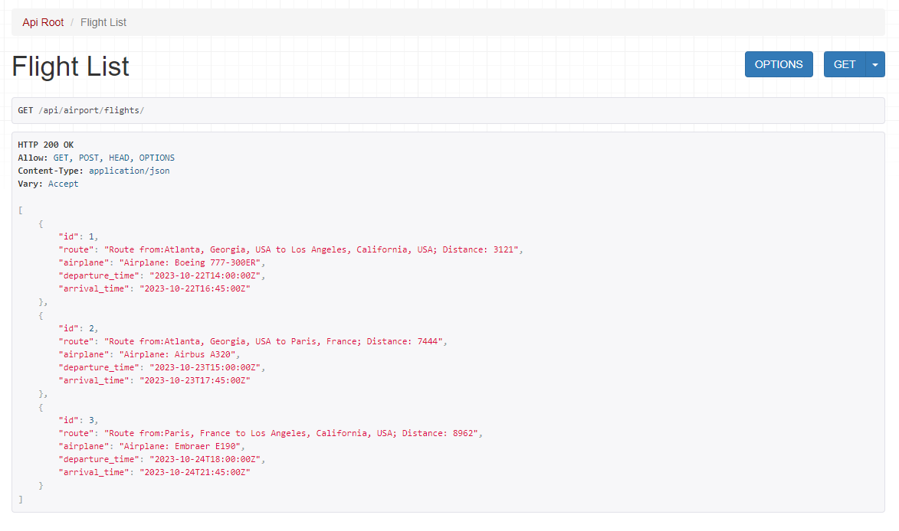

# Airport system API

API for airport service, that developed with Django REST Framework. 

## Features
* JWT Authentication
* Filters with django query_params
* User can create order with tickets
* Swagger documentation

## API DB diagram


## Installation
### Windows
```commandline
git clone https://github.com/RPodolets/Airport-system-api.git
cd airport-system-api
python3 -m venv venv
venv/bin/activate
pip install -r requirements.txt
python manage.py migrate
python manage.py runserver
```
### Mac / Linux
```commandline
git clone https://github.com/RPodolets/Airport-system-api.git
cd airport-system-api
python3 -m venv venv
source venv/bin/activate
pip install -r requirements.txt
python manage.py migrate
python manage.py runserver
```

### Get from docker hub
```commandline
docker pull dexpod/airport-system-api:latest
```

### Run with Docker
```commandline
docker-compose build
docker-compose up
```

## Demo pages


